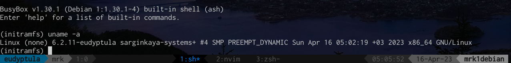

# task-3



```sh
diff -up Makefile.orig Makefile > /tmp/patch
```

```patch
--- Makefile.orig       2023-04-16 05:09:22.087845326 +0300
+++ Makefile    2023-04-16 05:01:40.188406946 +0300
@@ -2,7 +2,7 @@
 VERSION = 6
 PATCHLEVEL = 2
 SUBLEVEL = 11
-EXTRAVERSION =
+EXTRAVERSION = -eudyptula sarginkaya-systems
 NAME = Hurr durr I'ma ninja sloth
 
 # *DOCUMENTATION*
```